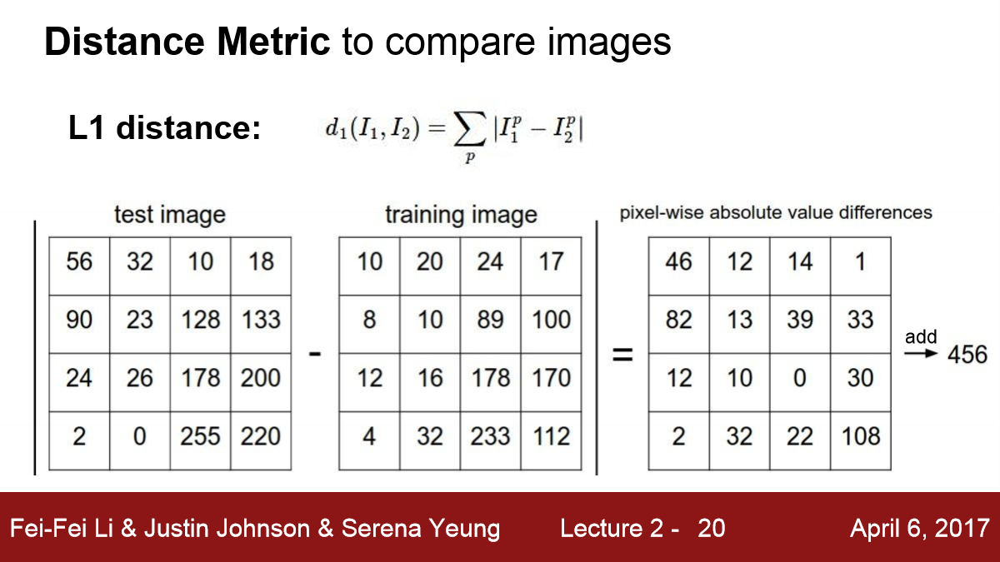
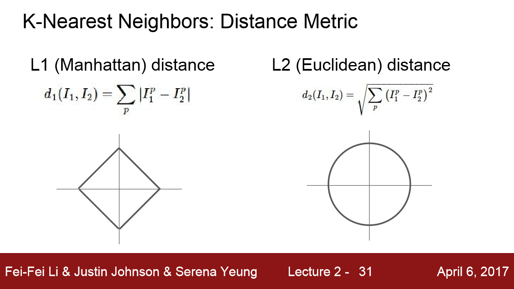
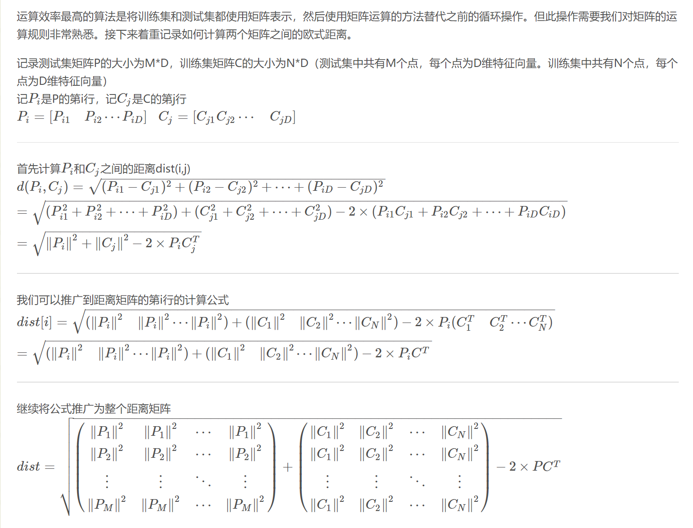
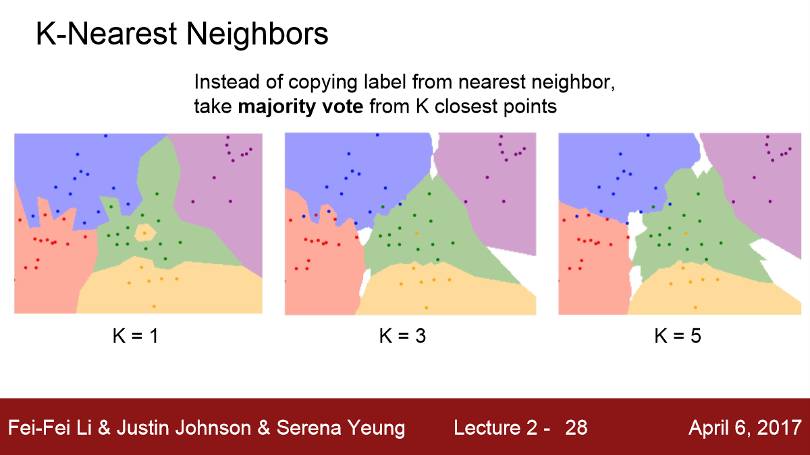
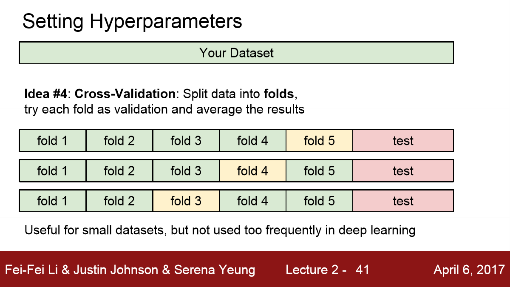
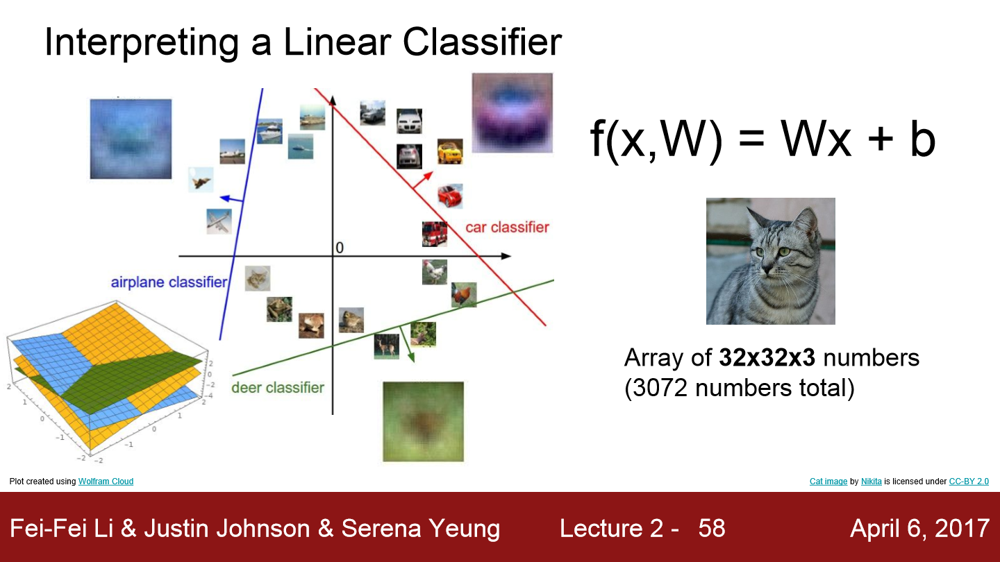
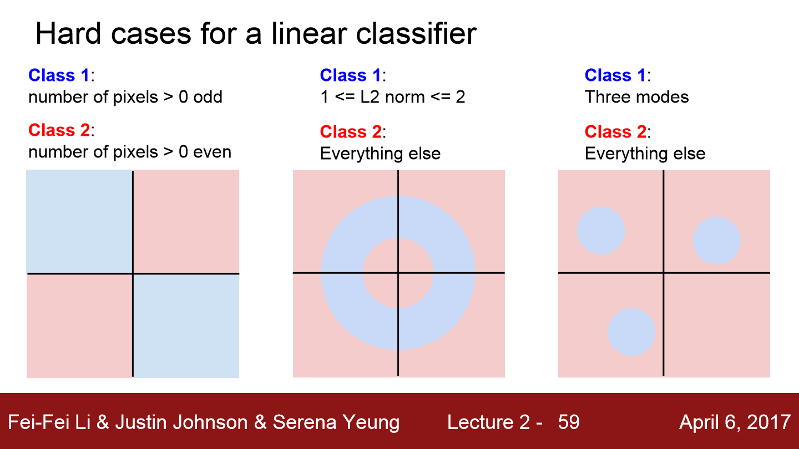

## Lecture 2

[TOC]

### Challenges

### L1 distance and L2 distance

> [计算两个矩阵之间的欧式距离](https://blog.csdn.net/frankzd/article/details/80251042)

### K-Nearest Neighbors

### Validation sets for Hyperparameter tuning

| A single validation split |              Cross-validation              |
| :-----------------------: | :----------------------------------------: |
|                           |         computationally expensive          |
|       First choice        |    The size of training data is small.     |
|                           | 3-fold, 5-fold or 10-fold cross-validation |

### Interpreting a Linear Classifier

- Geometric interpretation

As we change one of the rows of $W$, the corresponding line in the pixel space will rotate in different directions. The biases $b$, on the other hand, allow our classifiers to translate the lines. In particular, note that without the bias terms, plugging in $x_i=0$ would always give score of 0 regardless of the weights, so all lines would be forced to cross the origin.

- Interpretation of linear classifiers as template matching

Each row of $W$ corresponds to a **template** (or sometimes also called a *prototype*) for one of the classes. The score of each class for an image is then obtained by comparing each template with the image using an *inner product* (or *dot product*) one by one to find the one that “fits” best. With this terminology, the linear classifier is doing template matching, where the templates are learned. Another way to think of it is that we are still effectively doing Nearest Neighbor, but instead of having thousands of training images we are only using a single image per class (although we will learn it, and it does not necessarily have to be one of the images in the training set), and we use the (negative) inner product as the distance instead of the L1 or L2 distance.

### Hard Cases for a Linear Classifier

### Center data

It is important to center data by subtracting the mean from every feature. In the case of images, this corresponds to computing a mean image across the training images and subtracting it from every image to get images where the pixels range from approximately [-127, 127]. Further common preprocessing is to scale each input feature so that its values range from [-1, 1].