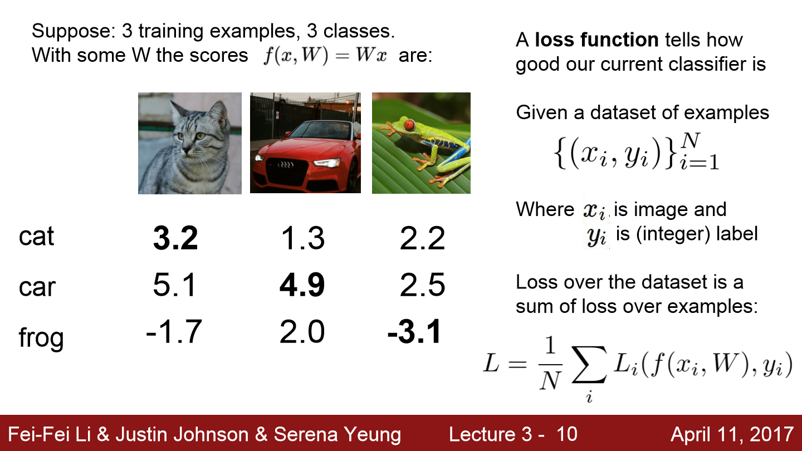
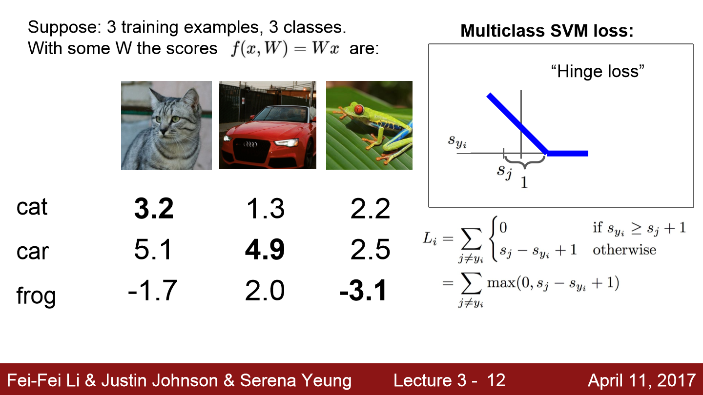
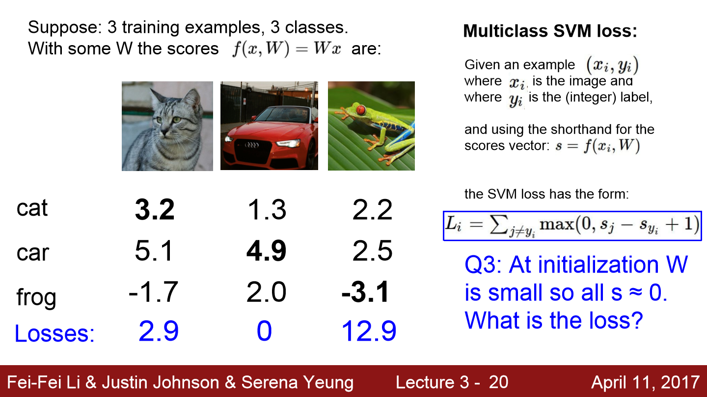
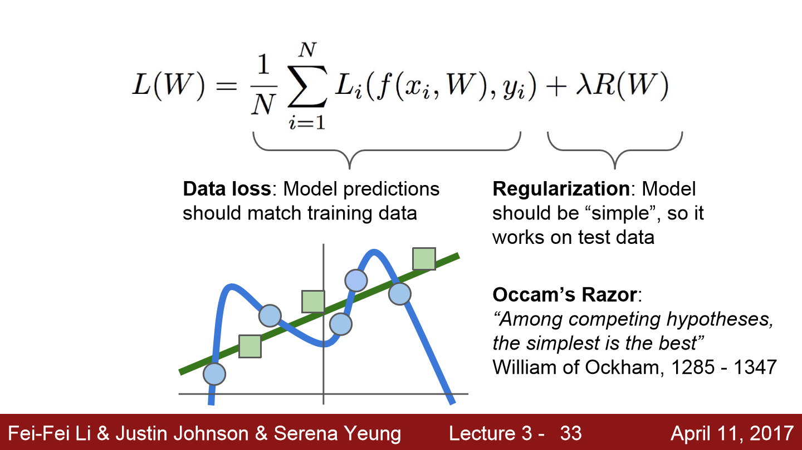
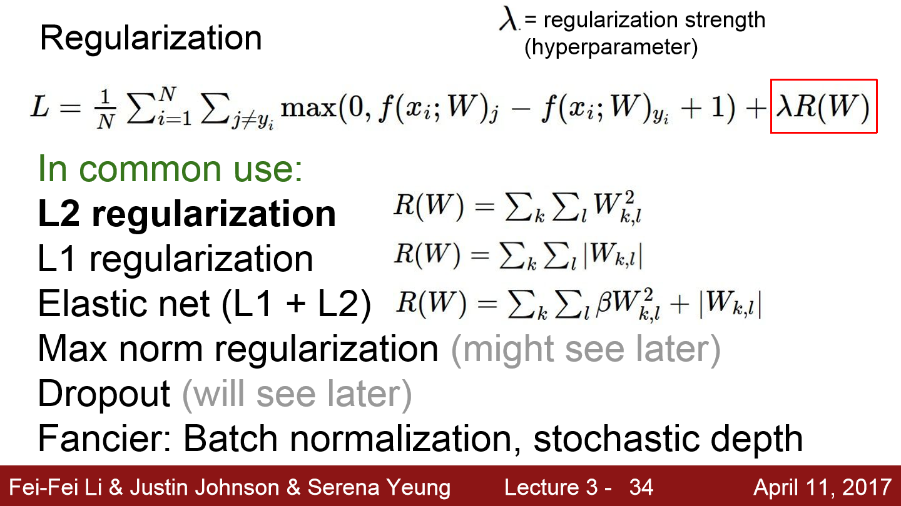
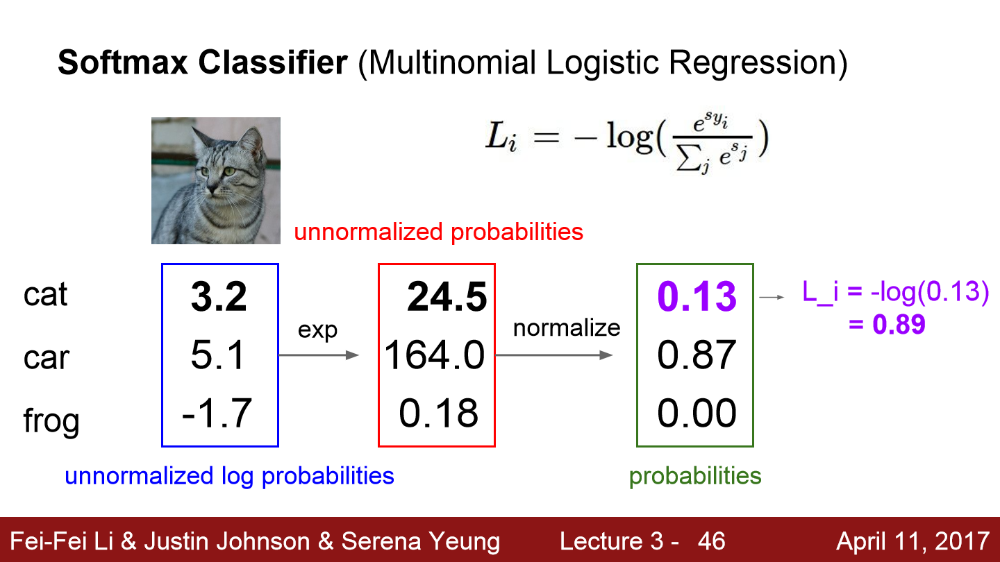
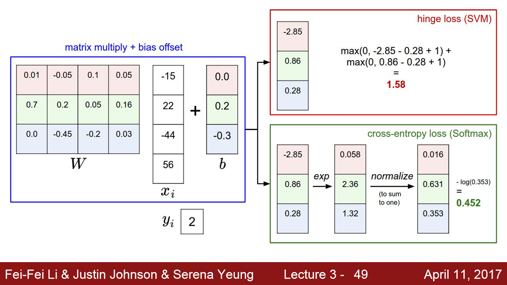
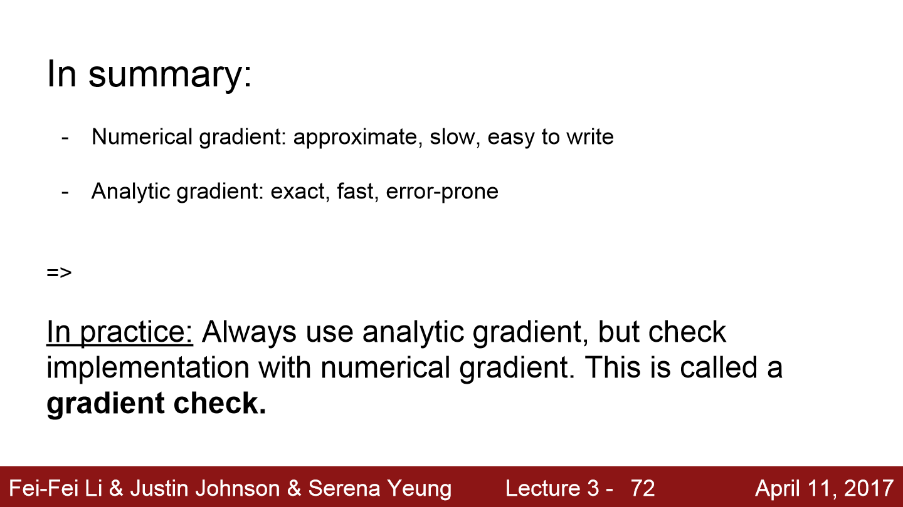
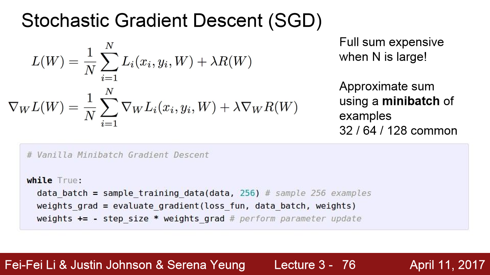

## Lecture 3

[TOC]

### Loss Function

At initialization W is small so all s ≈ 0, $L_i=k-1$.

#### Hinge Loss VS. Squared Hinge Loss

Loss Function: Quantify how bad the mistakes made by classifiers are.

- Hinge Loss: ignore a little bit wrong
- Squared Hinge Loss: we don’t want any wrong (increse wrong)
- The unsquared version is more standard, but in some datasets the squared hinge loss can work better. ==This can be determined during cross-validation.==

### Regularization

- Penalizing large weights tends to **improve generalization**, because it means that no input dimension can have a very large influence on the scores all by itself. Since the L2 penalty prefers smaller and more diffuse weight vectors, the final classifier is encouraged to take into account all input dimensions to small amounts rather than a few input dimensions and very strongly.
- Due to the regularization penalty we can never achieve loss of exactly 0.0 on all examples, because this would only be possible in the pathological setting of W=0.

- $$L_i = C \max(0, 1 - y_i w^Tx_i) + R(W)$$, where C is a hyperparameter, and $y_i\in{−1,1}$.

### Softmax

At initialization W is small so all s ≈ 0, $L_i=ln\frac{1}{k}$.

#### SVM VS. Softmax

- SVM: ignore correct
- Softmax: want to be better

### SGD

