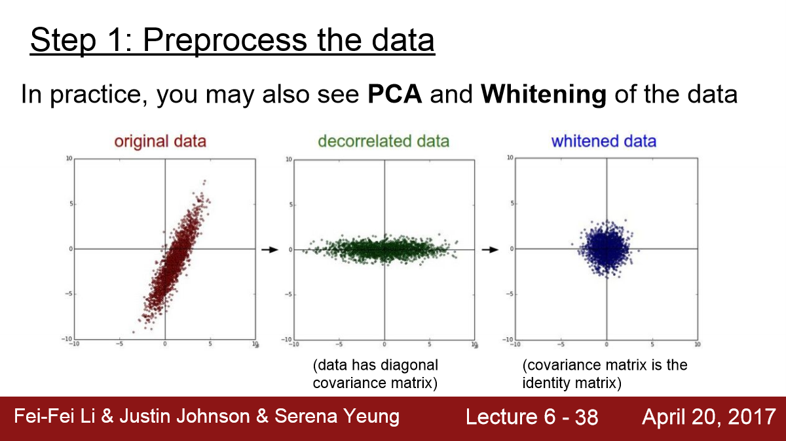
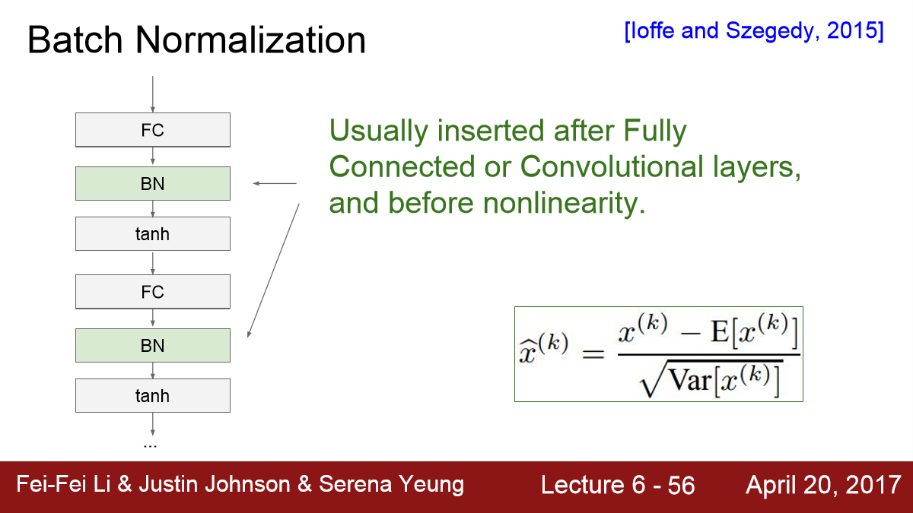
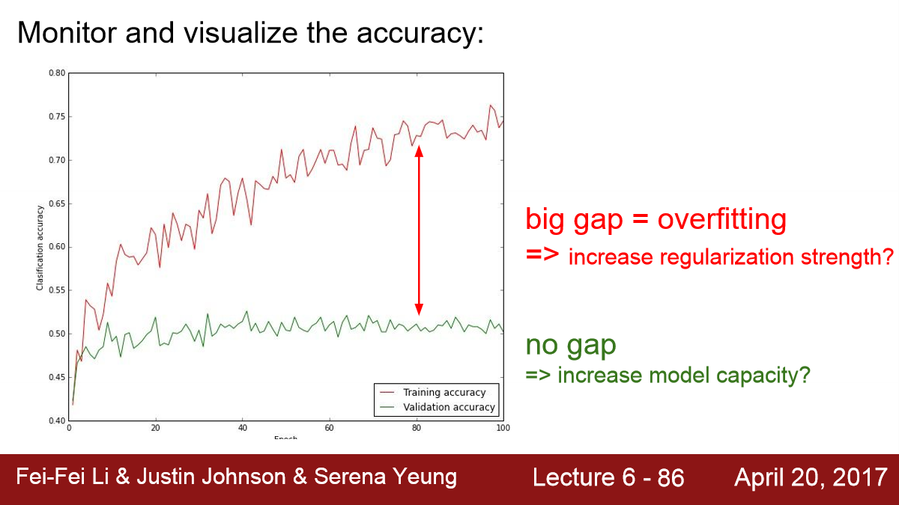

## Lecture 6

[TOC]

### Activation Functions

#### Sigmoid

#### tanh

#### ReLU

#### Leaky ReLU

#### ELU

#### In Practice

### Preprocess the Data

### Batch Normalization

### Babysitting the Learning Process

